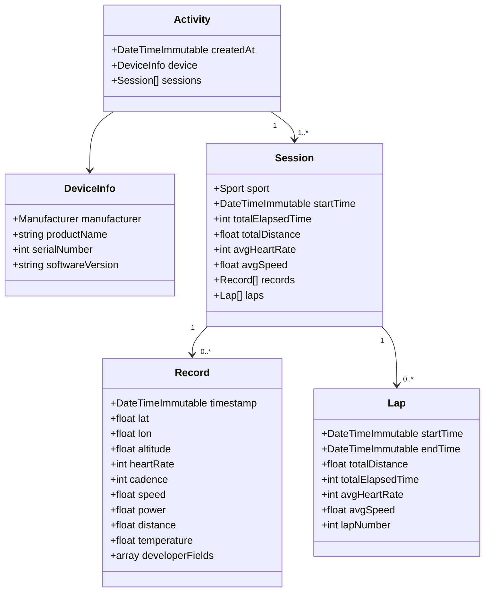
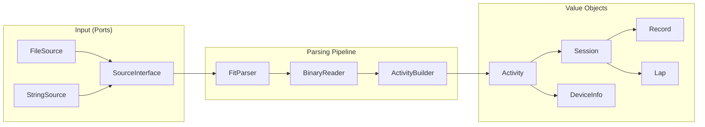
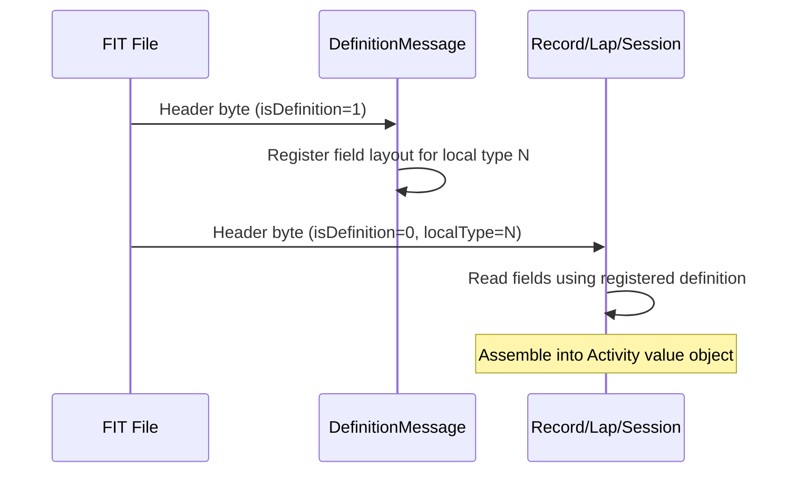

# php-fit-sdk

> Modern PHP 8.3+ library for parsing Garmin FIT binary files.

[](https://www.php.net)
[](LICENSE)
[](https://www.php-fig.org/psr/psr-12/)

FIT (Flexible and Interoperable Data Transfer) is Garmin's binary format used by GPS watches, bike computers, and fitness trackers. This library parses `.fit` files into typed, immutable PHP value objects — ready to use in Laravel, Symfony, Magento, or any PHP application.

---

## Features

- Parse FIT files from **Garmin, Wahoo, Polar, Decathlon/Kiprun** and any FIT-compatible device
- Extracts **GPS track, heart rate, cadence, speed, power, temperature**
- Supports **developer fields** (running dynamics: Form Power, Leg Spring Stiffness, Air Power, Impact Loading Rate, Effort Pace)
- **FIT → GPX export** with Garmin HR/cadence extensions, route-only mode, batch conversion
- **Activity analysis** — normalized stats, bounds, sensor presence, lap summaries, route sampling
- Fully typed, **immutable value objects** — no setters, no surprises
- **Zero framework dependencies** — works in Laravel, Magento, Symfony, or plain PHP
- PHP 8.3+ — readonly classes, enums, strict types throughout
- Pluggable input via `SourceInterface` — file path, binary string

---

## Installation

```bash
composer require beljic/php-fit-sdk
```

---

## Quick Start

```php
use Beljic\FitSdk\Parser\FitParser;

$activity = (new FitParser())->parseFile('my_run.fit');

// Device info
echo $activity->device->manufacturer->name;  // Garmin / Decathlon / Wahoo ...
echo $activity->device->productName;          // "KIPRUN GPS 900"

// First session summary
$session = $activity->sessions[0];
echo $session->sport->name;                          // Running
echo round($session->totalDistance / 1000, 2);       // 10.5 (km)
echo gmdate('H:i:s', $session->totalElapsedTime);    // 00:52:30
echo $session->avgHeartRate;                          // 158 (bpm)

// GPS track points
foreach ($session->records as $record) {
    echo "{$record->lat}, {$record->lon}";            // 44.8125, 20.4612
    echo $record->heartRate;                          // 162
    echo $record->altitude;                           // 118.4 (m)

    // Running dynamics (if device supports it)
    echo $record->developerFields['Form Power'] ?? null;           // 185 (W)
    echo $record->developerFields['Leg Spring Stiffness'] ?? null; // 9.8 (kN/m)
}

// Lap splits
foreach ($session->laps as $lap) {
    echo "Lap {$lap->lapNumber}: " . round($lap->totalDistance / 1000, 2) . " km";
    echo " | Avg HR: {$lap->avgHeartRate} bpm";
}
```

### Parse from binary string (e.g. HTTP upload)

```php
use Beljic\FitSdk\Parser\FitParser;
use Beljic\FitSdk\Source\StringSource;

$binary   = file_get_contents('php://input'); // or from $_FILES
$activity = (new FitParser())->parse(new StringSource($binary));
```

---

## Activity Analysis

`ActivityAnalyzer` computes normalized stats from a parsed `Activity` — no manual aggregation needed:

```php
use Beljic\FitSdk\Analysis\ActivityAnalyzer;

$activity = (new FitParser())->parseFile('my_run.fit');
$stats    = (new ActivityAnalyzer())->analyze($activity);

// Aggregated stats
echo round($stats->totalDistance / 1000, 2);   // 10.52 (km)
echo gmdate('H:i:s', $stats->movingTime);       // 00:51:20
echo $stats->avgHeartRate;                       // 158 bpm
echo round($stats->pace / 60, 2);               // 5.12 min/km

// Geographic bounds (for map viewport)
$bounds = $stats->bounds;
echo "{$bounds->minLat},{$bounds->minLon},{$bounds->maxLat},{$bounds->maxLon}";
$center = $bounds->center(); // ['lat' => ..., 'lon' => ...]

// Which sensors contributed data?
echo $stats->sensors->hasHeartRate;      // true
echo $stats->sensors->hasPower;          // false
echo $stats->sensors->hasDeveloperFields; // true

// Per-lap breakdown
foreach ($stats->laps as $lap) {
    echo "Lap {$lap->lapNumber}: " . round($lap->totalDistance / 1000, 2) . " km";
    echo " | Pace: " . gmdate('i:s', (int) $lap->pace) . " /km";
}
```

### Downsampled route for web maps

```php
// Returns at most 500 RoutePoint objects (lat/lon/altitude), always includes first and last
$route = (new ActivityAnalyzer())->sampleRoute($activity, maxPoints: 500);

$points = array_map(fn($p) => [$p->lat, $p->lon], $route);
// Pass $points to Leaflet, Mapbox, Google Maps, etc.
```

---

## GPX Export

```php
use Beljic\FitSdk\Export\GpxExporter;
use Beljic\FitSdk\Export\ExportOptions;

$activity = (new FitParser())->parseFile('my_run.fit');
$exporter = new GpxExporter();

// Export to string (with HR + cadence Garmin extensions)
$gpx = $exporter->export($activity);

// Export route only (no sensor data, smaller file)
$gpx = $exporter->export($activity, new ExportOptions(routeOnly: true));

// Export directly to file
$exporter->exportToFile($activity, '/path/to/output.gpx');
```

---

## Data Model



---

## Architecture



---

## FIT Protocol Overview

FIT files consist of **definition messages** and **data messages**:



This library supports:

| Global Message # | Type | Description |
|---|---|---|
| 0 | `file_id` | File metadata, creation time |
| 18 | `session` | Activity summary (sport, distance, HR, speed) |
| 19 | `lap` | Lap/interval splits |
| 20 | `record` | Individual data point (GPS, HR, power, cadence) |
| 23 | `device_info` | Manufacturer, product name, serial number |
| 206 | `field_description` | Developer field names and units |
| 207 | `developer_data_id` | Developer data registration |

All other message types are silently skipped (YAGNI).

---

## FIT Coordinate System

| Field | FIT encoding | Conversion |
|---|---|---|
| Latitude / Longitude | `sint32` semicircles | `degrees = semicircles × (180 / 2³¹)` |
| Altitude | `uint16` | `meters = raw / 5 − 500` |
| Speed | `uint16` mm/s | `m/s = raw / 1000` |
| Distance | `uint32` cm | `meters = raw / 100` |
| Timestamp | `uint32` FIT epoch | `unix = raw + 631065600` |
| Heart Rate | `uint8` bpm | direct |
| Power | `uint16` watts | direct |
| Cadence | `uint8` rpm | direct |

---

## CLI

```bash
# Parse and show activity summary
./bin/fit parse my_run.fit

# Show device info
./bin/fit info my_run.fit

# Export single FIT to GPX (stdout)
./bin/fit gpx my_run.fit

# Export route only (no HR/cadence extensions)
./bin/fit gpx my_run.fit --route-only

# Export to file
./bin/fit gpx my_run.fit --out=output.gpx

# Batch convert a directory of FIT files to GPX
./bin/fit bulk /path/to/fits --out=/path/to/gpx

# Batch with HR/cadence sensor data
./bin/fit bulk /path/to/fits --out=/path/to/gpx --with-sensors
```

Example output:
```
Created: 2024-03-15 08:30:00
Sessions: 1

Session 0:
  Sport:    Running
  Distance: 10.52 km
  Duration: 00:52:30
  Avg HR:   158 bpm
  Records:  3145
  Laps:     11
```

---

## Supported Devices

Any device that outputs standard FIT files. Tested with:

- **Decathlon KIPRUN GPS 900** (running dynamics: Form Power, Leg Spring Stiffness, Air Power, Impact Loading Rate, Effort Pace)
- Garmin Forerunner / Fenix series
- Garmin Edge series (cycling)
- **Coros Pace / Apex / Vertix**
- Wahoo ELEMNT
- Polar Vantage / Ignite
- Suunto 9 / Race

---

## Framework Integration

### Laravel

```php
// app/Services/FitService.php
use Beljic\FitSdk\Parser\FitParser;
use Beljic\FitSdk\Source\StringSource;

class FitService
{
    public function __construct(private readonly FitParser $parser) {}

    public function parseUpload(UploadedFile $file): Activity
    {
        return $this->parser->parse(new StringSource($file->get()));
    }
}
```

### Magento 2

```php
// Model/FitActivityParser.php
use Beljic\FitSdk\Parser\FitParser;
use Beljic\FitSdk\Data\Activity;

class FitActivityParser
{
    public function __construct(private readonly FitParser $parser) {}

    public function parse(string $filePath): Activity
    {
        return $this->parser->parseFile($filePath);
    }
}
```

---

## Roadmap

- [x] FIT binary parser (records, laps, sessions, device info)
- [x] Developer fields (running dynamics)
- [x] FIT → GPX export with Garmin extensions and batch CLI
- [x] Activity analysis — stats, bounds, sensor presence, route sampling
- [ ] HRV data (Heart Rate Variability intervals)
- [ ] Workout structure (planned workout steps)
- [ ] Multi-sport / triathlon session handling
- [ ] FIT file writing (export)
- [ ] `beljic/fit-analyzer` — AI-powered training analysis (separate package)

---

## Contributing

Pull requests welcome. Please follow PSR-12, keep `strict_types=1` in all files, and add tests for any new message type support.

---

## License

MIT © Dejan Beljic
